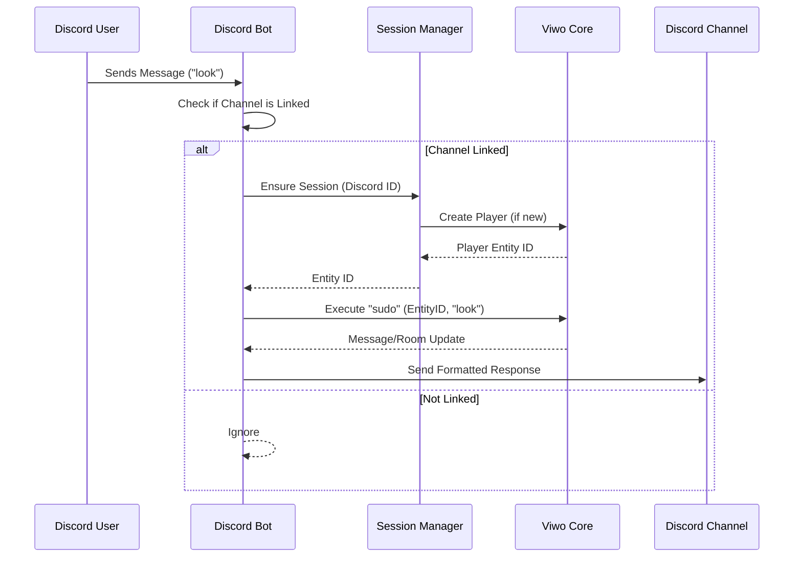

# Discord Bot

The Viwo Discord Bot bridges Discord channels with Viwo rooms, allowing users to interact with the game world directly from Discord.

## Architecture

The bot is built using `discord.js` and connects to the Viwo Core via a WebSocket connection (using `socketManager`).

### Key Components

- **`DiscordBot`**: Manages the Discord client, listeners, and message handling.
- **`SessionManager`**: Maps Discord User IDs to Viwo Entity IDs. It ensures every Discord user has a corresponding player entity in the game.
- **`SocketManager`**: Handles the WebSocket connection to the Core, sending commands and receiving updates.
- **`Database` (`db`)**: A simple local store (likely in-memory or JSON) to persist channel-to-room mappings and session data.

## Message Flow

When a user sends a message in a linked Discord channel, the following process occurs:

## Commands

- **`!link <room_id>`**: Links the current Discord channel to a specific Viwo room.
- **`!ping`**: Health check.
- **`!cmd`**: (Mocked) Slash command handler.

## Session Handling

Sessions are "sticky". Once a Discord user is mapped to a Viwo entity, that mapping persists.

1.  Check active session for (DiscordID, ChannelID).
2.  Check default entity for DiscordID.
3.  If neither, create a new Player entity via `create_player` RPC.
